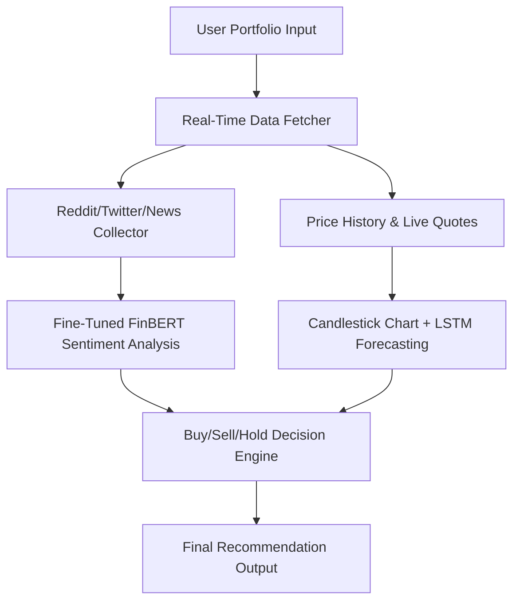

# 📈 TradeWise: AI-Powered Portfolio Optimization

## 📄 Abstract

The Intelligent Real-Time Portfolio Optimizer, branded as TradeWise, is an AI-powered platform designed to empower users with informed financial decisions by integrating live stock market data, social media sentiment, and deep learning models. It functions as a personalized assistant, offering buy, sell, or hold recommendations based on portfolio performance and market dynamics. This system leverages advanced natural language processing through sentiment analysis models like FinBERT and integrates time series forecasting using LSTM networks to predict future stock trends. The platform is deployed on Google Cloud for seamless scalability and real-time operation, laying a robust foundation for the future of AI-driven investing.

## 📝 Introduction

The dynamic and volatile nature of modern financial markets makes it increasingly important for investors to adopt intelligent tools for decision-making. Traditional portfolio management solutions often overlook real-time data and public sentiment, which can significantly influence stock prices. TradeWise addresses this gap by incorporating real-time sentiment analysis from social platforms and predictive modeling to offer timely, personalized investment recommendations.

### Key Objectives:
- To provide a reliable and scalable platform for real-time stock portfolio analysis.
- To personalize recommendations based on user holdings, budget, and market trends.
- To analyze sentiment from sources like Twitter, Reddit, and financial news.
- To employ deep learning models for accurate price forecasting.
- To visualize data through interactive charts and intuitive outputs.


## 🔧 Technologies and Tools

### Software and Frameworks:
- **Python**: Core development language.
- **Google Cloud Platform**: For hosting and deployment.
- **VS Code**: Preferred development environment.

### Machine Learning Libraries:
- `transformers`: Used for sentiment analysis with FinBERT.
- `PyTorch`, `TensorFlow`, `Keras`: For deep learning and time series forecasting.
- `scikit-learn`: For classical ML models and evaluation.
- `XGBoost`: For ensemble learning and comparison.

### APIs and Data Sources:
- `yfinance`: For historical and live stock price data.
- `alpha_vantage`: To collect OHLC and volume data.
- `Twitter API v2`: To gather real-time tweet data.
- `Reddit PRAW`: For Reddit posts and discussion scraping.
- `Finnhub`: For real-time financial news and summaries.

### Data Handling and Visualization:
- `pandas`, `numpy`: For data manipulation.
- `matplotlib`, `plotly`: For stock candlestick and trend plotting.

## 🚀 Proposed System

The TradeWise system functions as a comprehensive pipeline consisting of several interconnected modules. These include:

- **Portfolio Intake Module**: Allows users to enter their current holdings and investment budget.
- **Sentiment Analysis Module**: Utilizes fine-tuned FinBERT to analyze Reddit, Twitter, and news headlines.
- **Time Series Forecasting Module**: Implements LSTM models to forecast price trends for the next 3–5 days.
- **Recommendation Engine**: Combines sentiment and forecasting outputs with user portfolio to suggest buy/sell/hold actions.
- **Final Output**: Presents candlestick plots, forecasted trends, buy suggestions, and final portfolio recommendations.

## ⚙️ System Architecture



## 💻 Implementation

### A) Data Collection

Data was sourced from real-time APIs for both textual sentiment and market prices. Approximate ingestion rates include:
- **Reddit**: ~36,000 posts/hr from subreddits like r/stocks.
- **Twitter**: ~720 tweets/hr using cashtags ($TICKER).
- **Finnhub News**: ~3,600 articles/hr.
- **Stock Data**: Real-time and historical via yFinance and Alpha Vantage.

The collected data includes key fields like text content, timestamp, price history, engagement metrics (likes/retweets/upvotes), and ticker references.

### B) Algorithmic Implementation

#### Sentiment Analysis:
- Fine-tuned FinBERT on domain-specific datasets related to stock sentiment.
- Improved classification accuracy from **84.00%** (original) to **89.19%** post fine-tuning.
- Classified sentiment into **positive**, **negative**, and **neutral** categories.

#### Price Forecasting:
- Utilized LSTM networks trained on 5-year OHLC data.
- Forecasted 3–5 day stock trends, showing direction and confidence range.
- Achieved a forecasting accuracy of **87.4%**.

#### Recommendation Engine:
- If strong positive sentiment + forecast uptrend → **Buy**.
- If strong negative sentiment + forecast downtrend → **Sell**.
- If sentiment and forecast conflict or are neutral → **Hold**.
- Budget is optimized to suggest new buys with available funds.

## 📊 Results and Performance

### 🔹 Sentiment Analysis Accuracy

| Model               | Accuracy |
|--------------------|----------|
| Original FinBERT   | 84.00%   |
| Fine-Tuned FinBERT | 89.19%   |

### 🔹 Forecasting Accuracy

| Model | Accuracy |
|-------|----------|
| LSTM  | 87.4%    |

### 🔹 Key Outputs

- ✅ Candlestick chart for selected stocks.
  
  

- ✅ LSTM-based price forecast.
  
  

### 🔹 Final Outputs Comparison

#### 🔸 Original FinBERT Results:

- The outputs below show how Original FinBERT classifies stock-related text with moderate accuracy but sometimes lacks specificity in recommendation.

  
  
  

#### 🔸 Fine-Tuned FinBERT Results:

- With fine-tuning, FinBERT performs more precise sentiment classification, generating sharper and more actionable buy/sell signals that better align with stock price trends.

  
  
  

> 📌 The fine-tuned FinBERT model enhances the quality of sentiment-driven trading decisions, offering users more profitable and targeted buy recommendations.


## ☁️ Cloud Deployment

✅ Fully deployed on **Google Cloud Platform**, supporting:
- Real-time API-based access for recommendations.
- Cloud storage of user portfolios and model weights.
- Future-ready dashboard integration using Streamlit or Flask.

## 🔭 Future Work

- 🖥️ Streamlit/Flask dashboards for GUI.
- 🌍 Multilingual/International stock market support.
- 🔔 Auto-alert system for news/tweet anomalies.


## ✅ Conclusion

TradeWise demonstrates the capabilities of AI-driven systems in the realm of stock market analysis and portfolio management. By combining real-time sentiment insights and deep learning-based forecasting, the system empowers users to make timely and informed decisions. The fine-tuned models, robust architecture, and cloud infrastructure make it a practical and scalable solution. As it continues to evolve, TradeWise aims to become a go-to decision support tool for both novice and experienced investors seeking to optimize their portfolios intelligently.

## 📚 References

- [FinBERT](https://arxiv.org/abs/1908.10063)  
- [Alpha Vantage](https://www.alphavantage.co/)  
- [Yahoo Finance API](https://www.yahoofinanceapi.com/)  
- [Twitter API](https://developer.twitter.com/en/docs)  
- [Reddit PRAW](https://praw.readthedocs.io/)  
- [Finnhub](https://finnhub.io/)  
- [Scikit-learn](https://scikit-learn.org/)  
- [PyTorch](https://pytorch.org/)  
- [Keras](https://keras.io/)

## 📦 Installation

```bash
git clone https://github.com/your-username/Intelligent-Portfolio-Optimizer.git
cd Intelligent-Portfolio-Optimizer
pip install -r requirements.txt
```

### Add API keys in `.env` or `config.py`

```env
ALPHA_VANTAGE_KEY=your_key
TWITTER_BEARER_TOKEN=your_token
REDDIT_CLIENT_ID=your_id
REDDIT_SECRET=your_secret
FINNHUB_KEY=your_key
```
## 💾 Download the Fine-Tuned FinBERT Model
The fine-tuned FinBERT model required for sentiment analysis is hosted externally due to GitHub's file size limits.

👉 [📥 Click here to download the model](https://drive.google.com/drive/folders/1KbtVc4K7gk47Hgd_wkT5OvqKpUFcmDfz?usp=sharing)

After downloading, place the file in the root directory of the project (same folder as main.py).
### Run the app

```bash
python main.py
```

